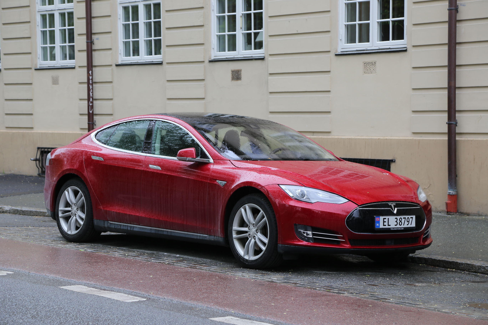

.. ImageAI documentation master file, created by
   sphinx-quickstart on Tue Jun 12 06:13:09 2018.
   You can adapt this file completely to your liking, but it should at least
   contain the root `toctree` directive.

Documentation officielle de ImageAI en Français !
===========================================
**ImageAI** est une bibliothèque python développée pour permettre aux développeurs, chercheurs, étudiants de construire des applications et des systèmes qui intègrent l’apprentissage profond et la vision assistée par ordinateur en utilisant simplement quelques lignes de code. 
Cette documentation est fournie pour donner assez de détails sur toutes classes et fonctions disponibles dans **ImageAI**, couples a un certain nombre d’exemples de code. 

**ImageAI** est un projet développé par `Moses Olafenwa <https://moses.specpal.science/>`_ et `John Olafenwa <https://john.specpal.science/>`_, the `AI Commons <https://commons.specpal.science/>`_ team. 

Le dossier official GitHub de **ImageAI** est `https://github.com/OlafenwaMoses/ImageAI <https://github.com/OlafenwaMoses/ImageAI />`_

Installation de ImageAI
===================
**ImageAI** nécessite que vous ayez Python 3.5.1 ou supérieur installe ainsi que d’autres librairies et bibliothèques python. Avant de procéder a l’installation de **ImageAI** vous devez installer les éléments suivants :  

* **Python** 3.5.1 or superieur,  `telecharger Python <https://www.python.org/downloads/>`_
* **pip3** ,  ` telecharger PyPi <https://pypi.python.org/pypi/pip/>`_
* **Tensorflow** 1.4.0 or superieur ::

    pip3 install --upgrade tensorflow
* **Numpy** 1.13.1 or superieur ::

    pip3 install numpy 
* **SciPy** .19.1 or superieur ::

    pip3 install scipy 
* **OpenCV** ::

    pip3 install opencv-python 
* **Pillow** ::

    pip3 install pillow 
* **Matplotlib** ::

    pip3 install matplotlib
* **h5py** ::

    pip3 install h5py
* **Keras** ::

    pip3 install keras

Une fois que vous avez installé tous ces packages sur votre ordinateur, vous pouvez installer **ImageAI** en utilisant la commande pip ci-dessous.
Installation de **ImageAI** ::

    pip3 install https://github.com/OlafenwaMoses/ImageAI/releases/download/2.0.2/imageai-2.0.2-py3-none-any.whl

Une fois que **ImageAI** est installé, vous pouvez en quelques lignes de code accomplir les tâches de vision assistée par ordinateur les plus puissantes comme vous pouvez le voir ci-dessous.  
**Reconnaissance d’Image**

*Retrouver tous les codes et la documentation via les liens dans la section en bas de page.*

* convertible : 52.459555864334106
* sports_car : 37.61284649372101
* pickup : 3.1751200556755066
* car_wheel : 1.817505806684494
* minivan : 1.7487050965428352

**Détection d’objets sur Image**

*Retrouver tous les codes et la documentation via les liens dans la section en bas de page.*

**Détection d’objets sur Vidéo**

*Retrouver tous les codes et la documentation via les liens dans la section en bas de page.*

**Analyse de détection Vidéo**

*Retrouver tous les codes et la documentation via les liens dans la section en bas de page.*

**Inférence et entrainement personnalise pour reconnaissance d’images**

*Retrouver tous les codes et la documentation via les liens dans la section en bas de page.*

.. figure:: image6.jpg
   :align:  center

Suivez les liens dans la section contenu ci-dessous pour retrouver tous les exemples et la documentation complète des classes et fonctions disponibles. 

.. toctree::
   :maxdepth: 2
   :caption: Contents:

   prediction/index
   detection/index
   video/index
   custom/index

Indices and tables
==================

* :ref:`genindex`
* :ref:`modindex`
* :ref:`search`

